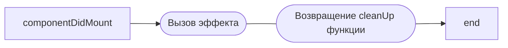
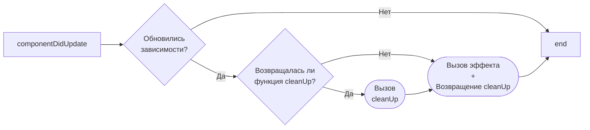
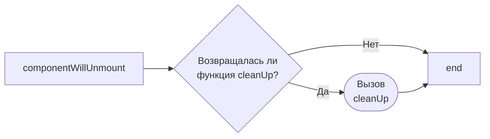

### Зачем нужен useEffect

- Асинхронные действия - запросы, таймеры
- Добавление/снятие обработчиков событий/подписок
- Манипуляции с рефами на DOM-элементы
- Асинхронная отправка метрик
- Асинхронная подгрузка статики - стили, переводы, скрипты

### Когда useEffect не нужен

- Трансформация данных для рендеринга
- Обработка пользовательских действий
- Получение данных с библиотеками TanStack Query, SWR, RTK Query, Apollo, Relay и пр.

### Анатомия useEffect

```javascript
useEffect(
  () => {
    // Эффект

    return () => {}; //cleanUp функция
  },
  [/* Зависимости */], // Помним про мемоизацию
);
```

```javascript
useEffect(() => {
  const handleEscapeKey = () => {};
  document.addEventListener("keyup", handleEscapeKey);

  return () => {
    document.removeEventListener("keyup", handleEscapeKey);
  };
}, []);
```

### componentDidMount

> [!NOTE]
> В режиме StrictMode вызывается дважды



### componentDidUpdate

> [!NOTE]
> Для использования в чистом виде, нужен паттерн isMounted



### componentWillUnmount



Источник https://www.youtube.com/watch?v=ivtRckdgfts
